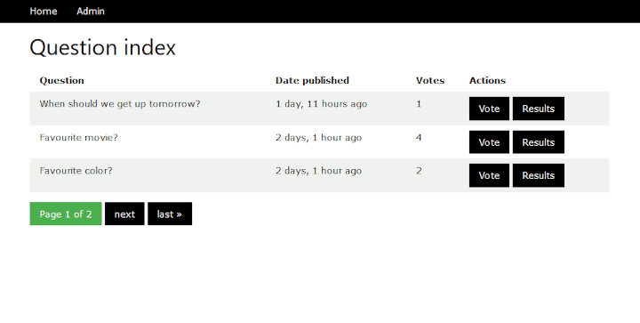

# django-poll
My take on the django polls app [tutorial](https://docs.djangoproject.com/en/3.1/intro/tutorial01/).

Uses [W3.CSS](https://www.w3schools.com/w3css/default.asp) and [Chart.js](https://www.chartjs.org/) to make it look nice.

